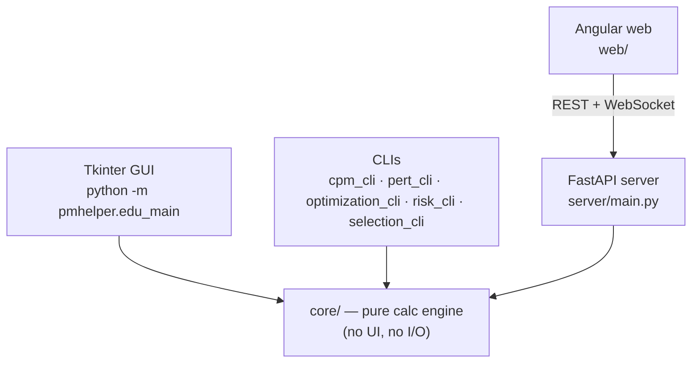

# Understand this codebase (PMHelper)

PMHelper is an **educational** project-management analysis tool. It teaches PM
math (CPM, PERT, EVM, risk, resource leveling, cost/NPV optimization, project
selection) by *showing its work* step by step.

## Two apps live in one repo — know which you're in
- **Edu edition (the active one):** entry `python -m pmhelper.edu_main` →
  `src/pmhelper/gui/main_window_edu.py` (`MainWindowEdu`). Everything ending in
  `*_edu.py` belongs here. **This is where new learning work happens.**
- **Legacy v1 app:** entry `python launch_app.py` → `src/pmhelper/gui/main_window.py`.
  Older; the Edu window was cloned from it and *"the original is never touched."*

Docs sometimes describe the legacy app or aspirational designs — trust the code,
not the guides, for exact import paths (see `docs/reports/CALCULATIONS_MIGRATION.md`
which is still a plan).

## The five surfaces (all share one calc engine)

| Surface | Lives in | How it runs |
|---|---|---|
| **Core calc engine** (pure Python, no UI/IO) | `src/pmhelper/core/*.py` | imported by everything |
| **Tkinter GUI** | `src/pmhelper/gui/` (tabs, widgets, services, models) | `python -m pmhelper.edu_main` |
| **FastAPI server** | `src/pmhelper/server/` (single app at `server/main.py`, routers in `server/api/routes/`) | `uvicorn pmhelper.server.main:app --reload` |
| **Angular web** | `web/` | `cd web && npm install && npm start` (:4200) |
| **CLIs** | `src/pmhelper/cli/` (cpm, pert, optimization, risk, selection) | `python -m pmhelper.cli.cpm_cli analyze ...` |

Dependency direction: `core` is the bottom layer — GUI, CLIs, and the server's
route modules all import it directly. `web` talks to `server` over REST +
WebSocket. Nothing in `core` imports upward.

> ⚠️ **`src/pmhelper/calculations.py` is not the calc engine.** Despite the name
> and its top-level position, it is a ~93-line **placeholder stub** whose body is
> `result = value * multiplier` under a `TODO`. It imports nothing from `core`.
> Only two callers use it — `server/api/routes/calculations.py` and
> `server/websockets/calculation_ws.py` (the legacy `/api/calculations/*` +
> WebSocket path). The **real** work goes `route → core` directly (e.g.
> `api/routes/web.py` imports `core.evm_calculations_edu`,
> `core.monte_carlo_edu`) or via `server/services/analysis_service.py`.
> Don't wire a new feature into `calculations.py`, and don't read it to learn the
> architecture. Note there is also a *different*, real
> `src/pmhelper/utils/calculations.py` (~400 lines of math helpers) — the two are
> unrelated despite the identical basename.

## The one mental model that unlocks the repo: the "Step" pattern
Every domain has a `core/<x>_step_generator.py` that returns a tree of `Step`
objects (`title, formula, substitution, result, interpretation, rag, children`).
Both the GUI (`gui/widgets/worked_solution_window.py`) and the web app render the
same steps. See `src/pmhelper/core/step_generators_edu.py`. Pure calc lives in
`core/<x>_edu.py`; the step generator wraps it into a teachable explanation.

## Shared GUI state
One `EduProjectState` object (`src/pmhelper/gui/edu_state.py`) is created once in
`MainWindowEdu` and passed to every tab. It uses an observer pattern
(`state.subscribe(...)`, `mark_dirty/mark_clean`). Project files are `.pmproj`,
saved/loaded via `src/pmhelper/utils/project_io_edu.py`.

## Recommended first files to open
`core/step_generators_edu.py` · `core/evm_calculations_edu.py` · `core/selection.py`
· `gui/main_window_edu.py` · `gui/edu_state.py` · `DECISIONS.md`.

## Related skills
[[pm-concepts-explained]] maps each PM concept to its module. [[add-a-feature]] shows
how a new tab is wired end-to-end. [[run-and-debug]] gets it running.
