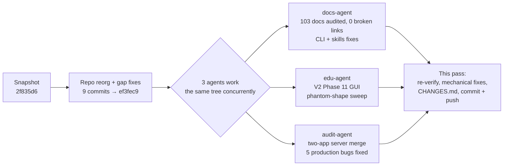

# Changes since `2f835d6`

This documents everything that happened on `EDU_PROD` between the
`chore: snapshot EDU_PROD work before repo reorganization` checkpoint
(`2f835d6`) and the work landed in this pass. It is a development-session
record, not a release changelog — see [CHANGELOG.md](CHANGELOG.md) for
version-level history.

Two phases happened back to back:

1. **A repo reorganization + gap-fixing pass** (9 commits, `2f835d6..ef3fec9`) —
   cleaned up folder structure, fixed a set of broken imports/config, and built
   a learning-skills library.
2. **A three-agent concurrent bug hunt** (`docs-agent`, `edu-agent`,
   `audit-agent`) working the same tree afterward, coordinating through a
   shared `AGENT_COORDINATION.md` board — which surfaced and fixed **several
   real, live production bugs**, none of which had ever been caught by a test.



Everything below was verified by running it, not just reading it (test counts,
CLI invocations, and server route lists were captured directly).

---

## Headline: real production bugs fixed

These were live and broken *before* this pass — not regressions introduced by
it. Ranked by how visible the breakage was to an actual user:

- **The PERT page in the deployed Angular app returned 500 on every request.**
  `POST /api/web/analysis/pert` called `results.get("activities")` on the
  3-tuple `PERTAnalyzer.analyze()` actually returns → `AttributeError` →
  swallowed by a broad `except Exception` → silent 500.
- **Learn Mode's PERT step-by-step walkthrough was also dead** — a second,
  separate endpoint (`/api/web/analysis/steps/pert`) had the same tuple-vs-dict
  mismatch.
- **`PERTAnalyzer` silently dropped every predecessor edge when called with a
  list** (as the API and GUI do — only the CSV loader passes the string form
  it expected). The result wasn't a crash: it built a fully-parallel network
  and returned *plausible but wrong* numbers. Any PERT result computed from
  non-CSV input (GUI, API, a saved report) should be treated as suspect.
- **Every background analysis job died instantly.** `analysis.py` and
  `project_service.py` called `get_db_session()` — the FastAPI *dependency*
  (a bare async generator, no `__aenter__`) — with `async with`, instead of the
  actual context-manager form `db_manager.get_session()`. `TypeError` on
  every `/api/analyze/cpm|pert|rcps` call and on `create_project`/`get_project`.
- **CPM and RCPS background jobs also failed**, separately: the service layer
  filtered graph nodes on `'latest_finish'`/`'activity_id'`, attributes that
  have never existed (`CPMAnalyzer` emits `ES/EF/LS/LF/float`, keyed by
  activity id). Every job's `max()` call raised on an empty list.
- **`POST /api/web/analysis/evm` and `/monte-carlo` were 500 on every call** —
  both imported classes (`EVMCalculator`, `MonteCarloSimulator`) that have
  never existed in this codebase. Rewritten against the real
  `compute_all_kpis()` / `run_simulation()` APIs.
- **The CLI crashed on a stock Windows console.** `pmhelper-cpm crash` (and
  several `optimization_cli` paths) printed `→`/`✓`/`≥` — code page 1252 can't
  encode them, so the crash was caught and re-printed as a confusing
  `'charmap' codec` error. Replaced with ASCII (`->`, `[OK]`), matching the
  existing convention.
- **`optimization_cli`'s `time-cost` subcommand had never worked** (a missing
  `dest='input_file'`), and three other subcommands called plotting/export
  functions with parameters or key names that don't exist. All four
  independent defects fixed; all 6 documented invocations now verified
  end-to-end.
- **`crashing_step_generator.py` computed the wrong cost-slope formula** for
  this codebase's data model — it derived slope from totals
  (`(CC−NC)/(ND−CD)`) when the stored `crash_cost` field is already a
  per-unit rate (`crash_cost_per_unit`), producing a slope-of-a-slope in the
  feature whose entire job is teaching the correct arithmetic. Had zero
  callers/tests before this pass.
- **Three independent bugs in the WBS↔cost-estimation sync**
  (`wbs_tab_edu._load_costs_from_estimation`): a constructor param that was
  never actually accepted, an attribute name that doesn't exist (`mw._tabs`
  vs. the real `mw.tabs`), and a result-field name that doesn't exist. The
  function had never worked.
- **The Crashing tab never received UG/PG mode changes** — missing from the
  tab-iteration dict in both GUI build paths — and **discarded its own
  results** (computed a `CrashingResult`, displayed it, then dropped it).
- **`tests/server/conftest.py` defined `pytest_configure` twice** — Python
  silently kept only the second, so no pytest marker was ever registered and
  `pytest -m unit` collected 0 tests without warning.

See `git log` and the fix commits below for exact file:line references.

---

## 1. Repository reorganization (`2f835d6..ef3fec9`, 9 commits)

- Moved ~100 scattered root files into a coherent structure: `docs/{guides,
  reports,plans,deployment,releases,reference}/`, `examples/`, `outputs/`
  (gitignored generated artifacts), `manual_tests/` (interactive/legacy tests
  excluded from the automated suite), `archive/` (retired code and entry
  points), `packaging/` (build/deploy scripts, PyInstaller specs).
- Fixed a **pytest config bug**: the old `pytest.ini` used a `[tool:pytest]`
  header, invalid in a `.ini` file, so `testpaths` was silently ignored and
  pytest scanned the whole repo. Consolidated into `pyproject.toml`.
- Restored `src/pmhelper/core/models.py` (selection dataclasses), recovered
  from history after an earlier deletion had silently broken
  `utils/selection_io.py` and the selection CLI.
- Fixed a route that broke the **entire FastAPI app at import time**
  (`status_code=204` + a `-> None` annotation tripped a FastAPI assertion).
- Fixed the `cmp_cli` → `cpm_cli` console-entry typo, an `evm_model_edu` →
  `evm_models_edu` import, and anchored the PyInstaller specs to the repo root
  (`SPECPATH`) after the packaging move — verified with a real Windows build.
- Completed `pyproject.toml`'s dependency list (was missing FastAPI, SQLAlchemy,
  pulp, customtkinter, and others — `pip install -e .` didn't actually install
  a working checkout) and moved `ztable.csv` into the package
  (`src/pmhelper/ztable.csv`), fixing a latent bug where neither PyInstaller
  spec bundled it — the built .exe shipped without Z-table lookups.
- Wrote 11 project skills (`.claude/skills/`) plus a global pattern library —
  several of which turned out to contain stale/incorrect claims, caught and
  fixed in the next phase (see below).
- Consolidated a doubled README.md (two concatenated copies from an old merge)
  into one coherent document.

## 2. Server & API (audit-agent)

- **Merged the two parallel FastAPI apps.** `server/api/main.py` is deleted;
  its request-logging middleware, global exception handler, and `/api/version`
  were ported into `server/main.py`, which now mounts every router
  (`projects`, `analysis`, `selection`, `web`, `calculations`). Consumers
  repointed: `desktop_server/server_control.py`, `tests/server/*`,
  `docs/guides/SELECTION_CLI_API_GUIDE.md`.

  ```mermaid
  flowchart LR
      subgraph before["Before — two apps, easy to deploy the wrong one"]
          A1["server/main.py<br/>calculations + WebSocket"]
          A2["server/api/main.py<br/>projects + analysis + selection"]
      end
      subgraph after["After — one app, everything mounted"]
          B1["server/main.py<br/>all routers + middleware + /api/version<br/>(35 verified routes)"]
      end
      A1 --> B1
      A2 --> B1
  ```
  - ⚠️ This exposes `/api/projects/*` CRUD + the DB layer on the public Render
    deploy for the first time (done knowingly — worth a security look).
  - `/debug/info` was deliberately **not** ported: it read config attributes
    that don't exist on `Config` and would have raised whenever `DEBUG=True`.
- **`render.yaml`'s branch pin was 10 commits stale** (`feat/web-v1`, predating
  the whole reorg) — repointed to `EDU_PROD`. Render was serving old code while
  deploys looked green.
- Empty `activities` lists are now rejected with `422` instead of validating,
  returning `202`, and dying in the background.
- API docs stay gated behind `DEBUG` at `/api/docs` (a deliberate product
  decision) — fixed `config.get_docs_url()`, which pointed at `/docs`, a path
  the app never serves.
- New: `tests/test_web_api_analysis.py` — 11 tests, the first to ever exercise
  the web router, run through the actual deployed app (`server.main:app`).

## 3. Educational GUI — V2 Phase 11 (edu-agent)

- Standardized the "show worked solution" button (4 inconsistent labels across
  8 tabs) to **`📊 Show All Calculations`**, and wired UG/PG mode gating onto
  all 9 calculator tabs (previously only implemented on 2).
- Fixed the Crashing tab's missing mode-dict registration and dropped results
  (above), the WBS↔cost-estimation sync (above), and a cost-toggle label that
  read backwards on first paint.
- A read-only "phantom-shape" sweep across `src/pmhelper/**` (import every
  module, AST-scan for dead callables, execute every step generator against
  its real producer) found the PERT-steps endpoint bug (above) and confirmed
  the rest of the step generators — EVM, CPM, financial, factor-scoring, RACI,
  three-point, risk, resource-leveling, cost-estimation — match their real data
  producers.
- Net result: `tests/test_cross_tab_polish.py` grew from 36 to 47 passing
  tests; zero regressions against the pre-sweep baseline.

## 4. CLI & console-output fixes (docs-agent)

- Fixed the cp1252/Unicode crashes and all four `optimization_cli` defects
  (above).
- Rewrote `tests/test_optimization_cli.py` from scratch — the old version's
  `try/except SystemExit: assert e.code == 0` silently passed without checking
  anything, and its fixture CSV header didn't match what the loader reads.
  22 tests now pass (was 14 failing).
- Restored 5 missing `.pmsel` example files (recovered from an unmerged
  branch, `28b9bc1`) that `EXAMPLE_LOADING_GUIDE.md` and
  `manual_tests/test_examples.py` depended on but never had.

## 5. Documentation audit (docs-agent)

- Audited all 103 markdown files against the actual code; **0 broken links**
  remain.
- Corrected the skills library where it had drifted from reality — most
  seriously, `run-and-debug`/`run-tests` claimed `pmhelper.core.models` was
  "long removed" and recommended deleting the resulting failures as "good
  first fixes" — the module exists and production code imports it.
  `understand-this-codebase` claimed `calculations.py` "routes by method" and
  is a good first file to read; it's a 93-line stub, and the real routing goes
  through `services/analysis_service.py`.
- Fixed `README.md` CLI examples (subcommands are required and were
  undocumented; `--confidence`/`--simulations` flags on `pert_cli` don't
  exist), 6 guide commands using pre-reorg paths, and 2 broken `LICENSE` links
  in the release notes.
- Flagged, not changed (design docs, not bugs): `docs/plans/` isn't marked
  historical the way `docs/reports/` is — forward-looking plans reference ~90
  files that never existed by design, which a reader could mistake for rot.

## 6. This pass — verification + mechanical fixes

Re-measured everything above rather than trusting the board, then closed out
the remaining safe, non-judgment-call items:

- **`tests/test_cost_optimization.py` (6F → fixed).** Its `MockCPMAnalyzer`
  fixture built graph nodes without an `EF` attribute; `TimeCostOptimizer`
  derives `normal_duration` from `max(EF)`, so it silently computed `0` and
  the crash loop went negative. Test-only; production code was fine.
- **`requirements.txt` was missing `tksheet`** — `pip install -r
  requirements.txt` (the Docker/Render path) would `ImportError` the moment
  the RCPS tab loaded. Added.
- **`docker-compose.yml`'s `DATABASE_URL` had no async driver** — bare
  `sqlite:///` reaches `create_async_engine` unrewritten (the config layer
  only rewrites `postgres://`), so `docker compose up` would die at boot.
  Fixed to `sqlite+aiosqlite:///`.
- **Deleted `src/pmhelper/config/`** — three 0-byte files, zero importers
  (confirmed by grep: `server/main.py`'s `from .config import config` is a
  *relative* import resolving to the real `server/config.py`, a different
  module). The `config/*.ini` package-data glob matched nothing.
- **Cleaned up ~25 generated demo artifacts that had been re-added at repo
  root** (`cost_breakdown.png`, `pareto_*.{csv,json,xlsx,png}`, etc.) —
  confirmed byte-identical duplicates of what already lives in the gitignored
  `outputs/`, produced by running the example scripts from the repo root
  (they write CWD-relative filenames). Removed from the index; not a code
  change.

---

## Verified state (re-measured, not assumed)

- **Tests:** `1384` collected (`0` collection errors), **`12 failed / 1369
  passed / 3 skipped / 3 errors`** on a full run — down from `58 failed` at the
  start of the reorg and `18 failed` before this pass's mechanical fixes.
- **Server:** `pmhelper.server.main:app` imports cleanly; `app.openapi()`
  reports **35 real routes** across `/api/web/*`, `/api/analyze/*`,
  `/api/selection/*`, `/api/projects/*`, `/api/calculations/*`, `/api/jobs/*`.
- **CLIs:** every documented `pmhelper-cpm`/`pmhelper-pert` subcommand
  (`sample`, `analyze`, `crash`, `probability`) run end-to-end and produce
  correct output; all 4 console scripts (`pmhelper`, `pmhelper-cpm`,
  `pmhelper-pert`, `pmhelper-gui`) resolve after `pip install -e .`.
- **Windows build:** `packaging/build_edu.ps1` runs a real PyInstaller build
  through to a finished `.exe` (verified in a prior pass; unaffected by this
  one's changes).

## Known remaining issues (deliberately not fixed here)

Each of these is real, understood, and needs a decision this pass didn't make
— not silently swept:

| Cluster | What | Why it's open |
|---|---|---|
| `tests/test_integration_edu.py` (2F), `test_phase5_edu.py` (4F) | The UG demo project grew from 8 tasks/BAC 120k to 15 tasks/BAC 250k; the risk-flagging test asserts the old scale, and the largest risk exposure (12,000) no longer clears the 5%-of-BAC threshold (12,500) — a *risk* teaching demo now flags zero risks. | Code is correct; the demo's risk register needs recalibrating. Pedagogy call. |
| `tests/test_selection_api.py` (6F) | Hits `http://localhost:8000` with bare `requests` instead of `TestClient`. | Mechanical port, not attempted this pass. |
| `tests/test_charter_feature.py` (3E) | A script with `if __name__` guards, not real pytest tests — some "tests" take fixture-shaped params pytest can't satisfy. | Needs rewriting as real tests, not a one-line fix. |
| 44 tests in `tests/server/{test_config,test_database,test_analysis_service}.py` | Silently skipped via `except ImportError: pytest.skip(...)` — they import symbols (`ServerConfig`, `AnalysisJobModel`, `get_session`) that were renamed long ago. | **Flagged as highest-value remaining work** — an identical silent-skip pattern in `tests/server`'s other fixtures hid 5 of the production bugs fixed in this pass. Assume these are hiding more until someone makes them run. |
| `setup.py` | Orphaned by PEP 621 (`pyproject.toml [project]` wins for `pip install`); already diverges from it (author email, extras, version). | Deletion needs a Docker-build re-verification first. |
| `.env.example` / `.env.production` | `load_dotenv()` is never called anywhere, despite `python-dotenv` being a declared dependency — copying `.env.example` to `.env` does nothing. | Minor; a product call on whether to wire it up or remove the files. |
| `pmhelper-gui` console script | Launches the legacy v1 window, not the Educational edition (`python -m pmhelper.edu_main`, no console script). PyPI users following the README get the "wrong" app. | Product decision on which should be the default — flagged in the README, not changed. |

---

## Methodology note

Three coordinating agent sessions (`docs-agent`, `edu-agent`, `audit-agent`)
worked this tree concurrently after the reorg, claiming non-overlapping file
sets via a shared board and cross-checking each other's findings before
marking anything landed. Every fix summarized above was driven end-to-end
(actual command run, actual assertion, actual hand-checked number) rather than
inferred from reading code — see the board's own "recurring failure mode"
note: four independent bugs across three agents shared the same root cause —
*code written against an object shape that never existed, was never executed,
and was never tested.* That pattern, more than any individual bug, is the
main finding of this pass.
