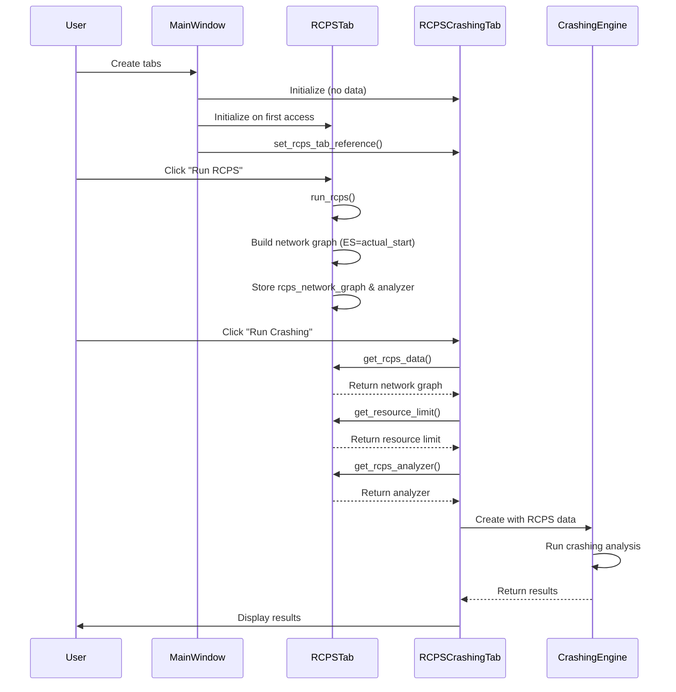

# Data Transfer Process: RCPS Tab → RCPS Crashing Tab

## Overview

This document explains the complete data transfer and communication process between the RCPS Tab and RCPS Crashing Tab in the PMHelper application.

## Architecture Overview

```
[Main Window]
    ↓
[Tab Initialization & Linking]
    ↓
[RCPS Tab] ──────────────────→ [RCPS Crashing Tab]
    ↓                                ↓
[Data Generation]              [Data Consumption]
    ↓                                ↓
[Network Graph Storage]        [Crashing Analysis]
```

## 1. Initial Setup & Tab Linking

### 1.1 Tab Creation Process

**Location**: `main_window.py`, lines 132-139

```python
# Step 1: Create RCPS Crashing tab first (without data reference)
self.rcps_crashing_tab = RCPSCrashingTab(self.notebook, self)
self.notebook.add(self.rcps_crashing_tab, text="RCPS Crashing")

# Step 2: Mark that linking is needed later
self.rcps_crashing_tab_needs_linking = True
```

### 1.2 Tab Linking Process

**Location**: `main_window.py`, lines 646-651

```python
def show_rcps_tab(self):
    if self.rcps_tab is None:
        # Step 3: Create RCPS tab when first accessed
        self.rcps_tab = RCPSTab(self.notebook, self)

        # Step 4: Link the tabs together (CRITICAL)
        if hasattr(self, 'rcps_crashing_tab') and hasattr(self, 'rcps_crashing_tab_needs_linking'):
            self.rcps_crashing_tab.set_rcps_tab_reference(self.rcps_tab)
            self.rcps_tab.rcps_crashing_tab = self.rcps_crashing_tab
```

### 1.3 Reference Setting

**Location**: `rcps_crashing_tab.py`, lines 30-34

```python
def set_rcps_tab_reference(self, rcps_tab):
    """Set reference to RCPS tab for data access"""
    self.rcps_tab = rcps_tab
    self.gui_manager.rcps_tab = rcps_tab
```

## 2. Data Generation in RCPS Tab

### 2.1 RCPS Analysis Execution

**Location**: `rcps_tab.py`, lines 269-429

When the user clicks "Run RCPS" button:

```python
def run_rcps(self):
    # Step 1: Get input parameters
    resource_limit = self.resource_limit_var.get()
    priority_rule = self.priority_rule_var.get()
    df_gantt = self.main_window.current_data

    # Step 2: Run RCPS analysis
    cmp_table, _, _ = analyzer.build_cmp_schedule_table(df_gantt, resource_limit)
    rcps_table, _, _ = analyzer.rcps_heuristic_schedule_table(df_gantt, resource_limit, priority_rule)

    # Step 3: Build and store network graph for RCPS Crashing
```

### 2.2 Network Graph Construction (CRITICAL)

**Location**: `rcps_tab.py`, lines 369-429

```python
# Build and store network graph for RCPS Crashing feature
# CRITICAL FIX: Use actual_start as ES for resource-aware crashing
import networkx as nx
G = nx.DiGraph()

# Add nodes with RCPS-specific attributes
for _, row in rcps_table.iterrows():
    if row['id'] not in ['RA', 'RS']:  # Skip resource rows
        # FIXED: Use actual_start as ES for crashing logic (resource-constrained schedule)
        actual_start = row['actual_start'] if 'actual_start' in row and row['actual_start'] != '' else row['early_start']
        duration = row['duration']
        early_finish = actual_start + duration

        node_attrs = {
            'duration': duration,
            'early_start': actual_start,  # ES is now actual_start from RCPS
            'late_finish': row['late_finish'],
            'float': row['float'],
            'EF': early_finish,           # EF based on actual_start (resource-constrained)
            'ES': actual_start            # For crashing, ES is actual_start (resource-aware)
        }

        # Add resource information if available
        if 'resource' in row:
            node_attrs['resource'] = row['resource']

        # Store actual_start explicitly for debugging and verification
        node_attrs['actual_start'] = actual_start

        # Add crash cost information if available in original data
        if hasattr(analyzer, 'activities'):
            for activity in analyzer.activities:
                if activity.get('id') == row['id']:
                    if 'crash_cost' in activity:
                        node_attrs['crash_cost'] = activity['crash_cost']
                    if 'min_duration' in activity:
                        node_attrs['min_duration'] = activity['min_duration']
                    break

        G.add_node(row['id'], **node_attrs)

# Rebuild edges from original project dependencies
if hasattr(analyzer, 'G') and analyzer.G is not None:
    # Copy edges from original analyzer graph
    for u, v in analyzer.G.edges():
        if u in G.nodes() and v in G.nodes():
            G.add_edge(u, v)
elif hasattr(analyzer, 'activities'):
    # Build edges from activities data
    for activity in analyzer.activities:
        activity_id = activity.get('id')
        predecessors = activity.get('predecessors', [])
        if activity_id in G.nodes():
            for pred in predecessors:
                if pred in G.nodes():
                    G.add_edge(pred, activity_id)

# Store the network graph and analyzer for RCPS Crashing
self.rcps_network_graph = G
self.rcps_analyzer = analyzer
```

### 2.3 Data Storage

**Location**: `rcps_tab.py`

The RCPS Tab stores three critical pieces of data:

```python
# Stored after RCPS analysis completes
self.rcps_network_graph = G          # NetworkX graph with actual_start as ES
self.rcps_analyzer = analyzer        # Original analyzer for additional data
self.resource_limit_var = IntVar()   # Resource limit setting
```

## 3. Data Access in RCPS Crashing Tab

### 3.1 Data Retrieval Methods

**Location**: `rcps_crashing_tab_gui.py`, lines 62-94

```python
def get_rcps_data(self):
    """Get RCPS network data from RCPS tab"""
    if self.rcps_tab is None:
        raise ValueError("RCPS tab reference not set. Please link RCPS Crashing tab to RCPS tab.")

    if not hasattr(self.rcps_tab, 'rcps_network_graph') or self.rcps_tab.rcps_network_graph is None:
        raise ValueError("No RCPS data available. Please run RCPS analysis first.")

    return self.rcps_tab.rcps_network_graph

def get_resource_limit(self):
    """Get resource limit from RCPS tab"""
    if self.rcps_tab and hasattr(self.rcps_tab, 'resource_limit_var'):
        try:
            return self.rcps_tab.resource_limit_var.get()
        except:
            pass
    return self.resource_limit  # Fallback to default

def get_rcps_analyzer(self):
    """Get RCPS analyzer from RCPS tab"""
    if self.rcps_tab is None:
        raise ValueError("RCPS tab reference not set.")

    if not hasattr(self.rcps_tab, 'rcps_analyzer') or self.rcps_tab.rcps_analyzer is None:
        raise ValueError("No RCPS analyzer available. Please run RCPS analysis first.")

    return self.rcps_tab.rcps_analyzer
```

### 3.2 Crashing Analysis Execution

**Location**: `rcps_crashing_tab_gui.py`, lines 116-146

```python
def run_crashing(self):
    # Step 1: Get RCPS data instead of CPM data
    try:
        rcps_graph = self.get_rcps_data()           # NetworkX graph with actual_start as ES
        resource_limit = self.get_resource_limit()  # Resource constraint
        original_analyzer = self.get_rcps_analyzer() # Original analyzer

    except ValueError as e:
        messagebox.showerror("RCPS Data Error", str(e))
        return

    # Step 2: Create RCPS analyzer with resource constraints
    rcps_analyzer = RCPSAnalyzer(rcps_graph, resource_limit, original_analyzer)

    # Step 3: Create RCPS crashing engine
    crashing_engine = RCPSProjectCrashing(rcps_analyzer, resource_limit)

    # Step 4: Run RCPS crashing analysis
    result = crashing_engine.run(
        target_duration=target_duration,
        strategy=strategy,
        objective=objective,
        max_budget=max_budget,
        max_crash_cost=max_crash_cost,
        max_normal_cost=max_normal_cost,
        max_iterations=max_iterations
    )
```

## 4. Critical Data Flow Points

### 4.1 Data Transformation Points

| Stage              | Location                                | Data Format    | Key Fields                                |
| ------------------ | --------------------------------------- | -------------- | ----------------------------------------- |
| **Input**          | `main_window.current_data`              | DataFrame      | `early_start`, `duration`, `resource`     |
| **RCPS Analysis**  | `rcps_tab.run_rcps()`                   | DataFrame      | `actual_start`, `early_start`, `duration` |
| **Network Graph**  | `rcps_tab.rcps_network_graph`           | NetworkX Graph | `ES=actual_start`, `EF`, `duration`       |
| **Crashing Input** | `rcps_crashing_tab_gui.get_rcps_data()` | NetworkX Graph | `ES`, `EF`, `crash_cost`                  |

### 4.2 Key Data Fields

**Before Fix (WRONG)**:

```python
# ES was set to early_start (theoretical CPM time)
node_attrs = {
    'ES': row['early_start'],  # ❌ Ignores resource constraints
    'EF': row['early_start'] + row['duration']
}
```

**After Fix (CORRECT)**:

```python
# ES is set to actual_start (resource-constrained time)
actual_start = row['actual_start'] if 'actual_start' in row else row['early_start']
node_attrs = {
    'ES': actual_start,        # ✅ Uses resource-constrained time
    'EF': actual_start + row['duration']
}
```

## 5. Data Validation & Error Handling

### 5.1 Validation Points

1. **Tab Reference Check**:

   ```python
   if self.rcps_tab is None:
       raise ValueError("RCPS tab reference not set")
   ```

2. **Data Availability Check**:

   ```python
   if not hasattr(self.rcps_tab, 'rcps_network_graph') or self.rcps_tab.rcps_network_graph is None:
       raise ValueError("No RCPS data available. Please run RCPS analysis first.")
   ```

3. **Network Graph Validation**:
   ```python
   if rcps_graph and rcps_graph.nodes():
       # Proceed with crashing analysis
   else:
       raise ValueError("Invalid or empty network graph")
   ```

### 5.2 Debug Verification

**Location**: `rcps_tab.py`, after network graph construction

```python
# DEBUG: Verify that ES values use actual_start (resource-constrained)
print(f"[DEBUG VERIFICATION] RCPS Network Graph built with {len(G.nodes())} nodes")
for node_id, attrs in G.nodes(data=True):
    if 'actual_start' in attrs and 'ES' in attrs:
        print(f"[DEBUG] Node {node_id}: ES={attrs['ES']}, actual_start={attrs['actual_start']}")
        if attrs['ES'] != attrs['actual_start']:
            print(f"[WARNING] Node {node_id}: ES != actual_start! This will cause incorrect crashing analysis.")
```

## 6. Data Flow Summary



## 7. Common Issues & Solutions

### 7.1 "No RCPS data available" Error

**Cause**: User tries to run RCPS Crashing before running RCPS analysis
**Solution**: Run RCPS analysis first to generate network graph

### 7.2 "RCPS tab reference not set" Error

**Cause**: Tab linking failed during initialization
**Solution**: Ensure `show_rcps_tab()` is called before accessing RCPS Crashing

### 7.3 Incorrect Crashing Results

**Cause**: ES values using `early_start` instead of `actual_start`
**Solution**: Fixed in latest implementation - ES now uses `actual_start`

## 8. Testing the Data Transfer

To verify correct data transfer:

1. **Run RCPS Analysis**: Check that `actual_start` differs from `early_start`
2. **Check Network Graph**: Verify ES = actual_start in stored graph
3. **Run RCPS Crashing**: Confirm crashing uses resource-constrained times
4. **Compare Results**: RCPS crashing should differ from regular crashing

The data transfer process is now properly implemented to ensure resource-aware crashing analysis.
