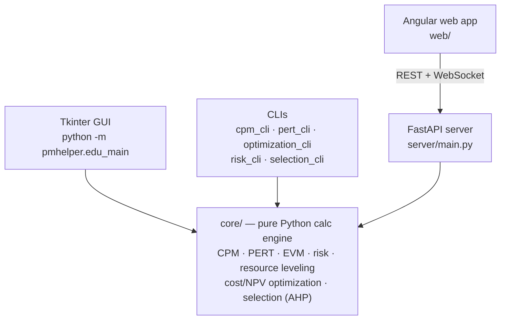

# PMHelper - Professional Project Management Analysis Tool

[](https://github.com/seifouda/PMhelper/actions/workflows/ci-cd.yml)
[](https://www.python.org/downloads/)
[](https://opensource.org/licenses/MIT)
[](https://badge.fury.io/py/pmhelper)
[](docs/)

A comprehensive, production-ready project management analysis desktop application implementing Critical Path Method (CPM), Program Evaluation Review Technique (PERT), and advanced scheduling optimization algorithms. Perfect for project managers, students, and researchers who need powerful scheduling analysis tools.

> **New here or returning after a while?** See **[CHANGES.md](CHANGES.md)** for
> what changed most recently — including several real bugs that were fixed in
> the server, CLI, and educational GUI, verified end-to-end rather than just
> read. `docs/README.md` is the full documentation index.

## Overview

PMHelper provides professional-grade project management analysis capabilities through both a graphical user interface and command-line tools. The application supports deterministic and probabilistic scheduling analysis, resource optimization, and advanced visualization features.

PMHelper is available via PyPI for easy installation (`pip install pmhelper`), as a standalone Windows executable, or can be run from source code. Choose the installation method that best fits your workflow and technical requirements.

### Architecture at a glance

Five surfaces share one pure calculation engine — nothing in `core/` depends on
any of the layers above it:



See [`docs/guides/SERVER_ARCHITECTURE.md`](docs/guides/SERVER_ARCHITECTURE.md)
for the server's internal design, and the **Project Structure** section below
for where everything lives on disk.

## Key Features

### Core Analysis Engines

- **Critical Path Method (CPM)**: Deterministic project scheduling with comprehensive float analysis
- **PERT Analysis**: Probabilistic scheduling using three-point estimates and beta distributions
- **Project Crashing**: Cost-optimized schedule compression with resource constraints
- **Resource-Constrained Project Scheduling (RCPS)**: Multi-resource optimization and leveling

### Advanced Capabilities

- **Monte Carlo Simulation**: Statistical analysis of project completion probabilities
- **Sensitivity Analysis**: Impact assessment of duration and cost variations
- **What-If Scenarios**: Interactive parameter exploration and optimization
- **Network Analysis**: Critical path identification and float calculations

### Professional Visualizations

- **Interactive Network Diagrams**: Dynamic project network visualization with critical path highlighting
- **Gantt Charts**: Timeline views with resource allocation and dependency tracking
- **Probability Distributions**: Statistical analysis charts and completion probability histograms
- **Performance Dashboards**: Real-time project metrics and key performance indicators

### Data Management

- **Multi-Format Support**: CSV, Excel (XLSX), JSON import/export capabilities
- **Project Templates**: Industry-standard templates and sample projects
- **Data Validation**: Robust input validation and comprehensive error handling
- **Backup & Recovery**: Automatic project state preservation and recovery

## Installation Options

Choose the installation method that best suits your needs:

### Option 1: PyPI Package (Recommended)

Install PMHelper directly from the Python Package Index:

```bash
pip install pmhelper
```

After installation, launch with:

```bash
# Launch the Educational edition — the shipped app
python -m pmhelper.edu_main

# Launch the legacy v1 interface
pmhelper-gui

# Use command-line tools
pmhelper --help
pmhelper-cpm --help
pmhelper-pert --help
```

> **Note:** the `pmhelper-gui` console script currently launches the **legacy v1**
> window (`pmhelper.gui.main_window`), not the Educational edition. Use
> `python -m pmhelper.edu_main` for the Edu app until an entry point is added
> for it.

### Option 2: Standalone Windows Executable

For Windows users who prefer a standalone application:

1. Download the latest `PMHelper-v1.0.0-windows.zip` from the [releases page](https://github.com/seifouda/PMhelper/releases)
2. Extract the entire folder to your desired location
3. Run `PMHelper.exe` from the extracted folder - no Python installation required!

**Note**: PMHelper is distributed as a folder containing the executable and all necessary support files. Moving only the .exe file without its supporting files will cause the application to fail.

### Option 3: Install from Source Code

For development or to access the latest features:

```bash
# Clone the repository
git clone https://github.com/seifouda/PMhelper.git
cd PMhelper

# Install the package with all runtime dependencies (editable mode)
pip install -e .

# For development (adds pytest, linters); for a Postgres deploy add [postgres]
pip install -e ".[dev]"
```

## Prerequisites

Before installing PMHelper, ensure you have:

- **PyPI Installation**: Python 3.8 or higher
- **Windows Standalone**: Windows 10+ (64-bit)
- **Source Installation**: Python 3.8 or higher
- **Operating System**: Windows 10+, macOS 10.14+, or Linux (Ubuntu 18.04+)
- **Memory**: 512MB RAM minimum, 2GB recommended for large projects
- **Storage**: 200MB free space

## Quick Start Guide

### GUI Application

After installation, launch the GUI application:

```bash
# Educational edition — the shipped app (works installed or from source)
python -m pmhelper.edu_main

# Legacy v1 interface, if installed via PyPI
pmhelper-gui

# If using standalone executable
# Run PMHelper.exe from the extracted folder

# Legacy v1 desktop app
python launch_app.py
```

### Command Line Usage

PMHelper provides powerful command-line interfaces for automation and batch processing:

Each CLI takes a **subcommand** first, and the input file is **positional**:

```bash
# Generate a sample input file to start from
pmhelper-cpm sample project_data.csv

# CPM analysis
pmhelper-cpm analyze project_data.csv -o results.json

# CPM crashing — compress the schedule to a target duration (both positional)
pmhelper-cpm crash project_data.csv 15 -o crashed.json

# PERT needs its own three-point input (optimistic/most_likely/pessimistic),
# so generate a PERT sample rather than reusing the CPM one
pmhelper-pert sample pert_data.csv
pmhelper-pert analyze pert_data.csv -o pert_results.json

# PERT probability of finishing within given durations
pmhelper-pert probability pert_data.csv -d 20 25 30

# Get help — including per-subcommand
pmhelper-cpm --help
pmhelper-cpm analyze --help
pmhelper-pert probability --help
```

### Sample Project Analysis

1. **Load Sample Data**: Import one of the included sample projects or your own CSV/Excel file
2. **Choose Analysis Method**: Select CPM for deterministic or PERT for probabilistic analysis
3. **Configure Parameters**: Set confidence levels, resource constraints, and optimization goals
4. **Generate Results**: View critical path, float analysis, and probability distributions
5. **Export Results**: Save reports, visualizations, and optimized schedules

### Input Data Format

PMHelper accepts project data in CSV or Excel format with the following columns:

```csv
Activity,Duration,Predecessors,Resources,Cost
A,5,,2,1000
B,3,A,1,800
C,7,A,3,1500
D,4,"B,C",2,1200
```

For PERT analysis, use three-point estimates:

```csv
Activity,Optimistic,MostLikely,Pessimistic,Predecessors
A,3,5,8,
B,2,3,5,A
C,5,7,10,A
D,3,4,6,"B,C"
```

For project crashing, add the crash columns:

```csv
Activity,Duration,Predecessors,Min Duration,Crash Cost,Normal Cost
A,5,,2,300,1000
B,3,A,1,200,600
C,4,A,2,150,800
```

### Resource Constraints (optional columns)

```csv
Resource_Type,Available_Quantity,Cost_Per_Unit,Max_Allocation
Engineers,5,100,8
Designers,3,80,6
Equipment,2,500,3
```

## 🛠️ Core Modules

### Analysis Engines (`src/pmhelper/core/`)

- **`cpm_analyzer.py`**: Critical path method implementation
- **`pert_analyzer.py`**: PERT probabilistic analysis
- **`network_builder.py`**: Project network construction and validation

### GUI Framework (`src/pmhelper/gui/`)

- **`main_window_edu.py`**: Educational edition — the shipped app (`python -m pmhelper.edu_main`)
- **`main_window.py`**: Legacy v1 interface (`python launch_app.py`)
- **`tabs/`**: Specialized analysis interfaces (Input, Results, Network, Gantt, Probability, …)

### Utilities (`src/pmhelper/utils/`)

- **`calculations.py`**: Mathematical and statistical functions
- **`visualizations.py`**: Chart generation and plotting
- **`file_handlers.py`**: Data import/export management

## 🔧 Advanced Usage

### Command Line Interface

```bash
# CPM Analysis (module form of pmhelper-cpm)
python -m pmhelper.cli.cpm_cli analyze project.csv -o results.json

# PERT probability analysis
python -m pmhelper.cli.pert_cli probability data.csv -d 20 25 30

# Optimization, risk, and selection CLIs (run with --help for options)
python -m pmhelper.cli.optimization_cli --help
python -m pmhelper.cli.risk_cli --help
python -m pmhelper.cli.selection_cli --help
```

### Programmatic API

```python
from pmhelper.core import CPMAnalyzer

# Activities: list of dicts with id, duration, and comma-separated predecessors
activities = [
    {"id": "A", "duration": 3, "predecessors": ""},
    {"id": "B", "duration": 4, "predecessors": "A"},
    {"id": "C", "duration": 2, "predecessors": "A"},
    {"id": "D", "duration": 1, "predecessors": "B,C"},
]

analyzer = CPMAnalyzer()
network_graph, critical_paths, critical_activities = analyzer.analyze(activities)

print("Critical path(s):", critical_paths)
# critical_activities lists only the activities on a critical path
# (plus the START/END sentinels) — not every node in the network.
print("Critical activities:", critical_activities)
```

For complete, runnable examples (cost optimization, risk, resource leveling,
multi-objective), see the [`examples/`](examples/) directory.

## 📁 Project Structure

```
PMhelper/
├── src/pmhelper/        # The package: core/ (pure calc engine), gui/, server/, cli/, utils/
├── web/                 # Angular web frontend
├── tests/               # Automated pytest suite (what `pytest` runs)
├── manual_tests/        # Interactive GUI/demo scripts — excluded from the automated run
├── examples/            # Runnable demo scripts
├── packaging/           # Build & deploy scripts (PyInstaller/cx_Freeze) + specs — see its README
├── scripts/             # Dev helper scripts (test runner, demo data generator)
├── docs/                # Documentation — see docs/README.md for the index
│   ├── guides/  reference/  plans/  reports/  deployment/  releases/  sample_project/
├── assets/  templates/  data/   # Example inputs, project/charter templates, sample data
├── archive/             # Retired prototypes and legacy entry points
├── outputs/             # Generated charts/reports (gitignored)
├── .claude/skills/      # Learning skills for this project
├── pyproject.toml       # Package metadata + all runtime dependencies (source of truth)
├── setup.py             # Legacy shim; pyproject.toml takes precedence for installs
├── requirements.txt     # Pinned dependency manifest for Docker/Render deploys
├── launch_app.py        # Legacy desktop entry (Edu app: python -m pmhelper.edu_main)
├── DECISIONS.md         # Recorded design decisions (why, not what)
└── Dockerfile  docker-compose.yml  render.yaml   # Containerization & deploy config
```

## 📚 Documentation

### Complete Documentation Suite

- **[📚 Documentation index](docs/README.md)**: All guides, references, plans, and reports
- **[🔧 Server architecture](docs/guides/SERVER_ARCHITECTURE.md)**: Backend design and implementation
- **[🔌 CLI & API guide](docs/guides/SELECTION_CLI_API_GUIDE.md)**: Command-line and API usage
- **[🏗️ Build & packaging](packaging/README.md)**: Building the executable and deploying
- **[🆕 Recent changes](CHANGES.md)**: What changed most recently, in detail (bug fixes, verification results, known issues)
- **[📝 Changelog](CHANGELOG.md)**: Version history and release notes

### Quick Reference

- **Sample projects**: `data/sample_project/`; example input files in `assets/`
- **Runnable examples**: `examples/`
- **Project & charter templates**: `templates/` and `data/charters/`

## 🧪 Testing & Quality Assurance

### Comprehensive automated test suite (1300+ tests)

```bash
# Run the full suite (coverage is configured in pyproject.toml)
python -m pytest

# Run a specific area
python -m pytest tests/test_evm_calculations_edu.py

# HTML coverage report
python -m pytest --cov=src/pmhelper --cov-report=html
```

> Interactive GUI and legacy tests live in `manual_tests/` and are excluded from
> the automated run.

### Continuous Integration

`.github/workflows/ci-cd.yml` runs:

- ✅ Automated testing on Windows, macOS, Linux (Python 3.8–3.12)
- ✅ Code quality analysis (black, flake8, mypy)
- ✅ Angular lint, build, and test for the `web/` app
- ✅ Package + executable builds, PyPI/GitHub release, Render deploy

Not currently in CI: security scanning and performance regression testing.

## 🤝 Contributing

### Development Setup

```bash
# Fork and clone repository
git clone https://github.com/seifouda/PMhelper.git
cd PMhelper

# Create a virtual environment
python -m venv .venv
source .venv/bin/activate        # Windows: .venv\Scripts\activate

# Install with development dependencies (pytest, coverage, linters)
pip install -e ".[dev]"

# Launch the app
python -m pmhelper.edu_main
```

### Making & Submitting Changes

```bash
# Create a feature branch
git checkout -b feature/your-feature-name

# ...make your changes, add tests, update documentation...

# Run tests and quality checks
pytest
black src/
flake8 src/

# Commit, push, then open a pull request on GitHub
git commit -m "feat: meaningful message"
git push origin feature/your-feature-name
```

### Code Standards

- **Style**: Black formatting, PEP 8 compliance
- **Documentation**: Comprehensive docstrings (Google style)
- **Testing**: Add tests for new features; keep the suite green
- **Type Hints**: Full typing annotation
- **Performance**: Consider the impact on large projects
- **Backward Compatibility**: Maintain API compatibility when possible

## 📈 Performance Specifications

### Scalability Benchmarks

| Project Size     | Load Time   | Analysis Time | Memory Usage |
| ---------------- | ----------- | ------------- | ------------ |
| 50 activities    | <1 second   | <1 second     | 45 MB        |
| 200 activities   | <3 seconds  | <2 seconds    | 85 MB        |
| 500 activities   | <8 seconds  | <5 seconds    | 150 MB       |
| 1000+ activities | <15 seconds | <10 seconds   | 280 MB       |

_Benchmarks on Intel i5-8400, 16GB RAM, Windows 11._ Network complexity: 5000+
dependencies handled efficiently.

### Algorithm Complexity

- **CPM Analysis**: O(V + E) where V=activities, E=dependencies
- **PERT Calculations**: O(n·m) where n=activities, m=simulations
- **Crashing Optimization**: O(n²) for heuristic algorithms
- **Resource Allocation**: O(n·k·t) where k=resources, t=time periods

## 🔒 Security & Privacy

- **Data Privacy**: All processing performed locally
- **No Internet Required**: Fully offline operation
- **Secure File Handling**: Input validation and sanitization
- **Access Control**: File permission respect and validation

### Reporting a Vulnerability

PMHelper handles project data locally and does not transmit sensitive information.
If you discover a security vulnerability, please:

1. **Do not** create a public issue
2. Email the maintainers directly
3. Provide detailed information about the vulnerability
4. Allow time for the issue to be addressed before public disclosure

### Important Security Notice

Some antivirus software, including Windows Defender, may flag PMHelper.exe as suspicious due to the way Python applications are packaged into standalone executables. This is a known false positive issue that affects many Python applications packaged with tools like cx_Freeze and PyInstaller.

**If Windows Defender flags PMHelper.exe:**

1. **This is a false positive** - The application contains no malicious code
2. **Whitelist the application** in Windows Defender:
   - Open Windows Security → Virus & threat protection
   - Under "Virus & threat protection settings", click "Manage settings"
   - Scroll down to "Exclusions" and click "Add or remove exclusions"
   - Add the PMHelper.exe file or its installation folder
3. **Alternative method**: Use the PyPI version by running `pip install pmhelper`

## 📧 Support & Community

### Getting Help

- **📖 Documentation**: [Documentation index](docs/README.md) — guides, references, reports
- **🐛 Bug Reports**: [GitHub Issues](https://github.com/seifouda/PMhelper/issues)
- **💡 Feature Requests**: [GitHub Discussions](https://github.com/seifouda/PMhelper/discussions)
- **📧 Email**: `support@pmhelper.dev`

### Professional Support

- **Training**: Available for enterprise users
- **Customization**: Custom feature development
- **Integration**: API development for enterprise systems
- **Consulting**: Project management methodology guidance

## 🗺️ Roadmap

### Upcoming Features (v1.1.0)

- **Web Interface**: Browser-based version for remote access
- **Advanced Reporting**: Export to PowerPoint and Word formats
- **Collaborative Features**: Multi-user project editing
- **API Integration**: REST API for external tool integration

### Future Enhancements (v2.0.0)

- **Machine Learning**: Predictive duration estimation
- **Portfolio Management**: Multi-project dashboard and optimization
- **Mobile App**: iOS and Android companion applications
- **Cloud Sync**: Project synchronization across devices

## 🙏 Acknowledgments

PMHelper is built on the shoulders of giants. Special thanks to:

- **Scientific Python Community**: NumPy, SciPy, Pandas, Matplotlib
- **Network Analysis**: NetworkX library developers
- **GUI Framework**: Python Tkinter maintainers
- **Project Management Theory**: Researchers and practitioners who developed CPM and PERT
- **Open Source Contributors**: Everyone who has contributed code, bug reports, and feedback
- **Academic Institutions**: Universities and schools that have adopted PMHelper for education

## 📄 License & Legal

**MIT License** - Free for commercial and personal use. See [LICENSE](LICENSE) for full details.

### Third-Party Dependencies

- **NetworkX**: Graph algorithms and network analysis
- **Matplotlib**: Professional-quality visualizations
- **NumPy/SciPy**: High-performance numerical computing
- **Pandas**: Data manipulation and analysis
- **Tkinter**: Cross-platform GUI framework

### Citing PMHelper

```bibtex
@software{pmhelper2025,
  title={PMHelper: Professional Project Management Analysis Tool},
  author={PMHelper Team},
  year={2025},
  version={1.0.0},
  url={https://github.com/seifouda/PMhelper}
}
```

---

**🎯 PMHelper v1.0** - Bringing professional project management analysis to everyone, everywhere.

_Built with ❤️ for project managers, engineers, and researchers worldwide._
