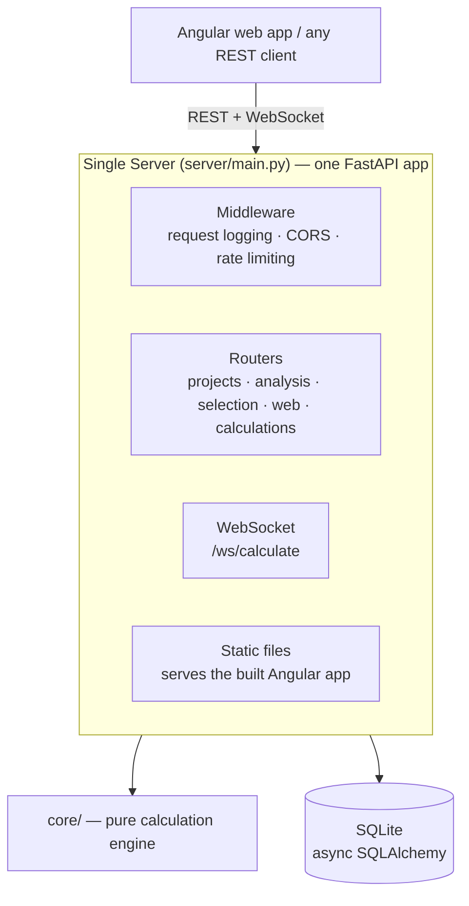

# PMHelper Server Architecture

## Overview

This document outlines the architecture decisions and design for the PMHelper server, optimized for low-budget deployment on an old laptop with plans for future cloud migration.

## Architecture Type: **Monolithic with Separation of Concerns**



> `server/api/main.py` — a second, parallel FastAPI app that used to exist — was
> merged into `server/main.py` above (see `CHANGES.md`). There is now exactly
> one app; every router mounts on it.

## Requirements Analysis

### Scale & Usage

- **Expected Users**: 10-100 concurrent users
- **Calculation Type**: Lightweight computations
- **Response Time**: Real-time (seconds)
- **User Experience**: Real-time results preferred

### Calculation Characteristics

- **Data Input**: Provided by users
- **Execution Model**: Mix of parallel and sequential calculations
- **Persistence**: Not required for MVP (no calculation queue persistence)
- **State**: Stateful with user-provided data

### Data & Storage

- **Data Size**: ~2MB per user/calculation
- **Database**: SQLite (sufficient for MVP)
- **File Storage**: Yes (uploads, results)
- **Data Retention**: Yes (historical data)

### Deployment & Infrastructure

- **Initial Deployment**: Self-hosted on old laptop
- **Future Plans**: Cloud migration (Railway, Render, or Fly.io)
- **Containerization**: Docker for portability
- **Frontend**: Angular with dynamic rendering

### Budget

- **Current**: $0-5/month
- **Strategy**: Maximize free tiers
- **Trade-off**: Willing to trade some performance for cost savings

## Technology Stack

### Backend

- **Framework**: FastAPI (async support, WebSocket native, excellent performance)
- **ORM**: SQLAlchemy (async)
- **Database**: SQLite (optimized for old laptop)
- **WebSocket**: Native FastAPI WebSocket support
- **Python Version**: 3.12+

### Frontend

- **Framework**: Angular
- **Deployment**: Static files served by FastAPI
- **Communication**: REST API + WebSocket for real-time updates

### DevOps

- **Containerization**: Docker + Docker Compose
- **Reverse Proxy**: Optional (Nginx/Caddy for production)
- **SSL**: Let's Encrypt (when deployed)

## Project Structure

```
PMhelper/
├── src/pmhelper/
│   ├── core/                    # Application Logic (Separate from Server)
│   │   ├── __init__.py
│   │   ├── calculator.py        # Pure calculation logic
│   │   ├── models.py            # Domain models
│   │   └── services.py          # Business logic orchestration
│   │
│   └── server/                  # Server Infrastructure
│       ├── __init__.py
│       ├── main.py              # FastAPI application entry point
│       ├── config.py            # Server configuration
│       │
│       ├── api/                 # REST API endpoints
│       │   ├── __init__.py
│       │   └── calculations.py  # Calculation endpoints
│       │
│       ├── database/            # Database layer
│       │   ├── __init__.py
│       │   ├── connection.py    # Connection management (optimized)
│       │   └── models.py        # SQLAlchemy models
│       │
│       └── websockets/          # WebSocket handlers
│           ├── __init__.py
│           └── calculation_ws.py # Real-time calculation handler
│
├── frontend/                    # Angular application
│   ├── src/
│   └── dist/                    # Built static files (served by FastAPI)
│
├── data/                        # Runtime data
│   └── pmhelper.db             # SQLite database
│
├── docker-compose.yml           # Container orchestration
├── Dockerfile                   # Container definition
└── pyproject.toml              # Python dependencies
```

## Design Principles

### 1. Separation of Concerns

- **Core Application Logic** (`src/pmhelper/core/`): Pure business logic, independent of server infrastructure
- **Server Infrastructure** (`src/pmhelper/server/`): API endpoints, WebSocket handlers, database connections

**Benefits:**

- Test calculations without starting the server
- Reuse core logic in CLI, notebooks, or other contexts
- Change server implementation without affecting business logic
- Easier maintenance and debugging

### 2. Async-First Architecture

- All I/O operations are asynchronous
- Better resource utilization on old hardware
- Handles multiple concurrent users efficiently

### 3. Optimized for Low Resources

- SQLite optimizations for slower disk I/O
- Connection pooling with timeouts
- Reduced automatic database operations (`autoflush=False`)
- Connection recycling to prevent memory leaks

## Database Configuration

### SQLite Optimizations for Old Laptop

```python
# Increased timeout for slower disk I/O
connect_args = {
    "check_same_thread": False,
    "timeout": 30,  # 30 seconds instead of default 5s
}

# Connection pool settings
pool_pre_ping=True,      # Verify connections before use
pool_recycle=3600,       # Recycle after 1 hour

# Session settings
expire_on_commit=False,  # Don't expire objects after commit
autoflush=False         # Reduce automatic DB operations
```

### When to Migrate to PostgreSQL

- **Users exceed 100 concurrent**
- **Data size exceeds 100MB**
- **Need advanced features** (full-text search, JSON queries)
- **Moving to cloud** (managed database services)

## API Design

### REST Endpoints

The list below was captured directly from the running app
(`app.openapi()["paths"]` — plain `app.routes` under-reports, since included
routers nest and don't flatten). 35 routes, grouped by router:

- **Calculations (legacy path):** `POST /api/calculations/calculate`,
  `GET /api/calculations/health`
- **Background analysis jobs:** `POST /api/analyze/{cpm,pert,rcps}`,
  `GET /api/jobs`, `GET /api/jobs/{job_id}/status`,
  `GET /api/jobs/{job_id}/results`
- **Projects (CRUD):** `GET/POST /api/projects`, `GET /api/projects/{id}`,
  `GET /api/projects/{id}/activities`, `GET /api/projects/{id}/analysis-jobs`
- **Selection:** `POST /api/selection/{ahp,linear-scoring,benefit-cost,portfolio}`,
  `GET /api/selection/methods`, `GET /api/selection/health`
- **Web app (`/api/web/*`, used by the Angular frontend):**
  `POST /api/web/analysis/{cpm,pert,rcps,evm,monte-carlo,crashing,risk}`,
  `POST /api/web/analysis/steps/{cpm,pert,evm}`,
  `POST /api/web/import/csv`, `GET /api/web/samples`,
  `GET /api/web/samples/{sample_id}`, `POST /api/web/telemetry/error`
- **Meta:** `GET /`, `GET /health`, `GET /api/version`

> **The SPA catch-all route (`@app.get("/{full_path:path}")`) must stay
> registered last.** FastAPI matches routes in registration order — anything
> included after it is silently swallowed and returns `index.html` instead of
> 404ing or reaching your new endpoint.

### WebSocket Endpoints

```
WS /ws/calculate
- Bidirectional communication
- Real-time calculation updates
- No database storage (ephemeral)
- Use Case: Interactive calculations, live updates
```

### Message Format

**Client → Server:**

```json
{
  "type": "calculate",
  "data": {
    "value": 42,
    "parameters": {}
  }
}
```

**Server → Client:**

```json
{
  "type": "result",
  "success": true,
  "data": {
    "result": 84,
    "execution_time_ms": 15.2,
    "metadata": {}
  }
}
```

## Deployment Strategy

### Phase 1: Self-Hosted (Current)

**Target**: Old laptop at home

**Setup:**

1. Install Docker Desktop for Windows
2. Run `docker-compose up`
3. Access via `http://localhost:8000`
4. Optional: Port forwarding + DDNS for external access

**Cost**: $0/month

**Limitations:**

- Limited uptime (dependent on laptop being on)
- Home internet speed
- No guaranteed availability

### Phase 2: Cloud Migration (Future)

**Recommended Platforms:**

| Platform     | Free Tier       | When to Use       | Monthly Cost |
| ------------ | --------------- | ----------------- | ------------ |
| Railway.app  | 500 hours/month | MVP testing       | $0-5         |
| Render.com   | 750 hours/month | Production ready  | $0-7         |
| Fly.io       | 3 shared VMs    | Global deployment | $0-5         |
| DigitalOcean | None            | Need control      | $6+          |

**Migration Steps:**

1. Push Docker image to registry
2. Deploy container to chosen platform
3. Migrate SQLite to PostgreSQL
4. Set up domain + SSL
5. Configure environment variables

## Scaling Strategy

### Current Capacity: 10-100 Users

**When to Scale:**

- Response time > 5 seconds
- CPU usage consistently > 80%
- Database locks becoming frequent

### Scaling Path

#### Stage 1: Optimize Current Setup (0-100 users)

- ✅ Already optimized for old laptop
- Add Redis for caching (optional)
- Database query optimization

#### Stage 2: Vertical Scaling (100-500 users)

- Upgrade to cloud VM (2GB RAM)
- Migrate to PostgreSQL
- Add Redis for session storage
- **Cost**: ~$12-17/month

#### Stage 3: Horizontal Scaling (500+ users)

- Load balancer + multiple app instances
- Separate database server
- CDN for static files
- Background job queue (Celery + Redis)
- **Cost**: ~$50-100/month

## Security Considerations

### MVP (Current)

- Basic CORS configuration
- Input validation
- Error handling without exposing internals

### Production (Future)

- [ ] Add authentication (JWT or OAuth)
- [ ] Rate limiting
- [ ] HTTPS (Let's Encrypt)
- [ ] Input sanitization
- [ ] SQL injection prevention (using ORM)
- [ ] Secrets management (environment variables)
- [ ] Logging and monitoring

## Performance Optimizations

### For Old Laptop

1. **Database**:

   - Increased connection timeout (30s)
   - Connection pre-ping validation
   - Reduced autoflush operations

2. **Application**:

   - Async operations throughout
   - Efficient connection pooling
   - Minimal memory footprint

3. **Frontend**:
   - Static file serving
   - Gzip compression (in production)
   - Lazy loading (Angular)

## Monitoring & Maintenance

### Essential Metrics

- Response time per endpoint
- Active WebSocket connections
- Database query performance
- Memory usage
- CPU utilization

### Logging Strategy

- Structured logging (JSON format)
- Log levels: DEBUG (dev), INFO (prod)
- Centralized logs (when on cloud)

### Health Checks

- `/health` endpoint
- Database connectivity check
- Disk space monitoring

## Testing Strategy

### Unit Tests

- Core calculation logic (independent of server)
- Service layer (business logic)
- No database dependencies

### Integration Tests

- API endpoints with test database
- WebSocket connection handling
- Database operations

### Load Tests

- Concurrent user simulation
- WebSocket stress testing
- Database performance under load

## Future Enhancements

### Short-term (1-3 months)

- [ ] User authentication
- [ ] Calculation history
- [ ] Export results (PDF, CSV)
- [ ] Basic analytics dashboard

### Medium-term (3-6 months)

- [ ] Background job queue for long calculations
- [ ] Multi-user collaboration
- [ ] API rate limiting
- [ ] Comprehensive monitoring

### Long-term (6+ months)

- [ ] Microservices architecture (if needed)
- [ ] Mobile app support
- [ ] Advanced caching strategy
- [ ] Internationalization

## Decision Log

| Date       | Decision                | Rationale                                   |
| ---------- | ----------------------- | ------------------------------------------- |
| 2025-10-28 | FastAPI + SQLite        | Async support, lightweight, perfect for MVP |
| 2025-10-28 | Monolithic architecture | Simplest for small team, lowest cost        |
| 2025-10-28 | Core/Server separation  | Testability, reusability, maintainability   |
| 2025-10-28 | Native WebSockets       | No extra dependencies, built into FastAPI   |
| 2025-10-28 | Self-host initially     | Zero cost, test before cloud investment     |
| 2025-10-28 | SQLite optimizations    | Old laptop has slower disk I/O              |

## Conclusion

This architecture provides:

- ✅ **Low cost**: $0 initially, $5-20/month when scaled
- ✅ **Simplicity**: Single codebase, easy to understand
- ✅ **Scalability**: Clear path from laptop to cloud
- ✅ **Maintainability**: Separated concerns, testable
- ✅ **Performance**: Async throughout, optimized for resources
- ✅ **Flexibility**: Easy to add features or change deployment

The design prioritizes **getting to MVP quickly** while maintaining **clean architecture** for future growth.
